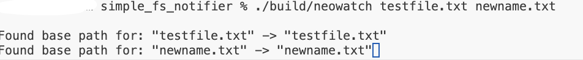
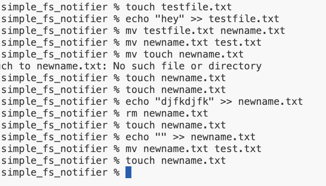
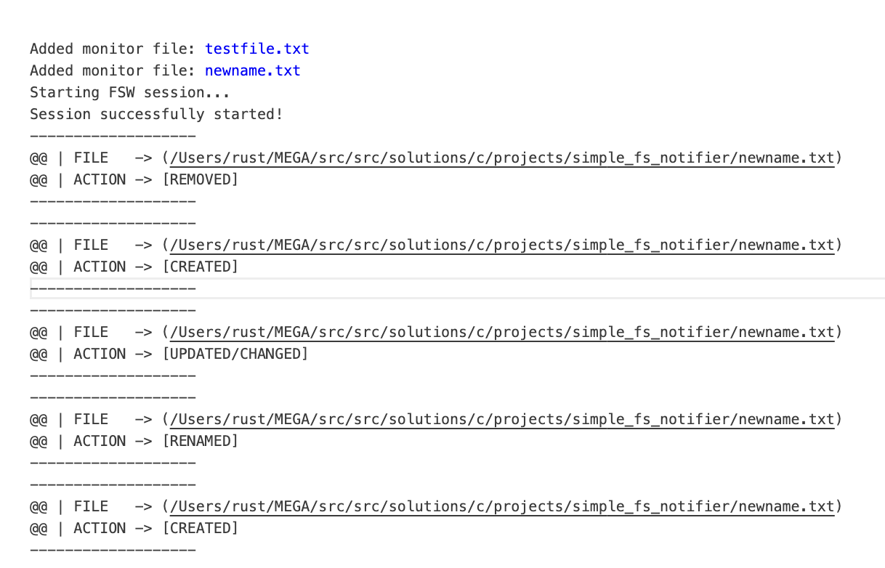

# Simple File Event Watchdog

> This little CLI program allows you to monitor predefined set of events which are fired when some action is performed on a given file(s).


# Usage
1. Build
```bash
make
```

2. Execute
```bash
./build/neowatch testfile.txt newname.txt
```

> Where `testfile.txt` and `newname.txt` are sample names of files to monitor.
> 
> You can list whatever files you want.


# Usage Example & Results
### 1. Start application:


### 2. Modify files you listed before as input for application:


### 3. Check out the results of monitoring inside `monitor.log` file:
